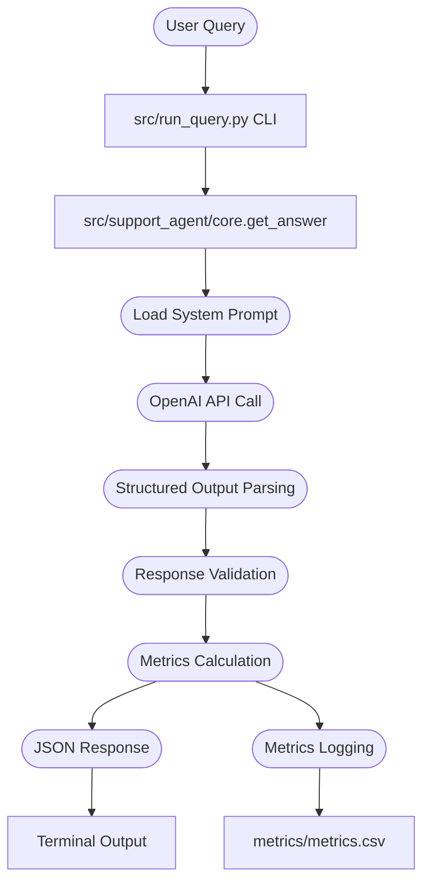

# P1 Report: Support Agent Assistant

## Architecture Overview

The Support Agent Assistant is a lightweight system that accepts user queries and returns structured JSON responses with confidence estimates and recommended actions. 
The system is designed as a command-line interface (CLI) tool that can be installed as an editable package. It leverages OpenAI's `GPT-5-mini` model with structured output capabilities to ensure consistent and valid responses.

The architecture consists of the following components:



### Component Breakdown

1. **CLI Entry Point** (`src/run_query.py`): Accepts user queries via command-line arguments and optional `--metrics` flag
2. **Core Logic** (`src/support_agent/core.py`): Orchestrates the OpenAI API call, response parsing, and metrics tracking
3. **Prompt Template** (`prompts/main_prompt.md`): Contains the system instruction for the assistant
4. **Structured Output Models**: Uses Pydantic models (`SupportAgentResponse` and `Metrics`) for schema validation
5. **Metrics Storage**(`metrics/metrics.csv`): Appends per-query metrics to CSV file with timestamp, token counts, latency, and cost


### Key Design Decisions

- **Structured Outputs**: Used OpenAI's `response_format` parameter with Pydantic models to guarantee valid JSON schema
- **Model Selection**: `gpt-5-mini` for cost-efficiency while maintaining quality
- **Metrics Tracking**: Comprehensive logging including cached tokens for accurate cost estimation
- **Minimal Reasoning**: Set `reasoning_effort='minimal'` to reduce latency and cost for straightforward support queries

## Prompt Technique(s)

**Primary Technique: Instruction-Based Prompting with Structured Output Constraints**

The implementation uses a clear instruction-based system prompt that specifies:

```markdown
You are a helpful assistant for a customer support agent. Your task is to assist 
the agent in responding to customer inquiries by providing accurate and concise information.

Your answer should contain the following:
* A clear and concise response to the customer's question.
* Recommended actions.
* Confidence estimates.
```

**Why This Technique:**

1. **Clarity**: Simple, unambiguous instructions reduce hallucination and improve consistency
2. **Structured Output**: Combined with Pydantic schema validation via OpenAI's `response_format`, ensures downstream systems always receive valid JSON with required fields (`answer`, `actions`, `confidence`)
3. **Task-Specific**: Focuses the model on the support agent use case without unnecessary complexity
4. **Reliability**: Instruction-based prompts are proven to work well with GPT models and provide predictable outputs

**Alternative Techniques Considered:**

- **Few-Shot Learning**: Not implemented as the instruction-based approach provided sufficient quality for the demo scope
- **Chain-of-Thought**: Overkill for straightforward Q&A; would increase latency and cost unnecessarily
- **Self-Consistency**: Multiple completions would be expensive; single completion with structured output validation is sufficient

## Metrics Summary

Based on test runs, the system demonstrates the following performance characteristics:

| Metric | Example Value | Description |
|--------|--------------|-------------|
| **timestamp** | 1762111045 | Unix epoch time of the query |
| **tokens_prompt** | 181 | The count of input tokens to the model |
| **tokens_completion** | 208 | The count of output tokens from the model |
| **total_tokens** | 390 | Sum of prompt (input) and completion (output) tokens |
| **latency_ms** | 3,887 | API response time in milliseconds; varies with network and OpenAI load |
| **estimated_cost_usd** | $0.000462 | Estimated cost of the query in USD |

**Cost Analysis:**

Using `gpt-5-mini` pricing:
- Input: $0.25 per 1M tokens
- Cached: $0.025 per 1M tokens  
- Output: $2.00 per 1M tokens

## Sample Results

**Query:** "How can I reset my password if I've forgotten it?"

**Response:**
```json
{
    "answer": "To reset a forgotten password, use the 'Forgot password' link on the sign-in page. Enter the email address (or username) associated with your account when prompted. You will receive an email with a secure reset link or one-time code—follow the instructions in that message to create a new password. If you don't receive the email, check your spam/junk folder and any other email addresses you may have used.",
    "actions": [
        "Go to the sign-in page and click 'Forgot password'",
        "Enter the email address or username tied to the account",
        "Open the reset email and follow the link or enter the one-time code",
        "Choose a strong new password and confirm it",
        "If no email arrives, check spam/junk and alternate email addresses",
        "If you can't access that email or don't receive the reset email after 15 minutes, contact support with your account details (email, username, last successful login)"
    ],
    "confidence": 0.92
}
```

**Metrics:**
```json
{
    "timestamp": 1762111045,
    "tokens_prompt": 182,
    "tokens_completion": 208,
    "total_tokens": 390,
    "latency_ms": 3887.35,
    "estimated_cost_usd": 0.0004615
}
```

**Sample CSV File**:
| timestamp           | tokens_prompt | tokens_completion | total_tokens | latency_ms       | estimated_cost_usd |
|---------------------|---------------|-------------------|--------------|------------------|--------------------|
| 2025-11-02T21:17:25 | 182           | 208               | 390          | 3887.35032081604 | 0.0004615          |

**Analysis:**
- **Answer Quality**: Comprehensive, actionable response with fallback instructions
- **Actions**: 6 step-by-step recommended actions for the support agent
- **Confidence**: 0.92 (high) indicates the model is certain about password reset procedures
- **Performance**: Sub-4-second response time is acceptable for support workflows
- **Cost**: $0.00046 per query is extremely cost-effective

## Challenges

1. **No Real Knowledge Base**: The system operates in a vacuum without access to actual company policies, product documentation, or customer data. Responses are generic best practices rather than company-specific guidance.

2. **Confidence Calibration**: The model assigns high confidence (0.92) even for generic responses. In production, confidence scores should be calibrated against actual answer correctness using human evaluation data.

3. **Latency Variability**: Response times range from 3.8s to 8s, affected by network conditions and OpenAI API load. For real-time support, this variability could impact user experience.

4. **No Safety/Moderation Layer**: The current implementation lacks input validation for adversarial prompts, jailbreak attempts, or inappropriate content. A production system would need content moderation.

5. **Limited Context**: Single-turn queries don't maintain conversation history, limiting the assistant's ability to handle follow-up questions or complex multi-step support scenarios.

6. **Schema Rigidity**: While Pydantic validation ensures correct structure, it cannot validate semantic correctness (e.g., actions that don't match the answer).

## Further Improvements

### Short-Term Enhancements

1. **Retrieval-Augmented Generation (RAG)**: Integrate a vector database with company-specific documentation, FAQs, and policies. Use semantic search to provide relevant context before generating responses.

2. **Safety & Moderation**: 
   - Add OpenAI Moderation API check before processing queries
   - Implement input sanitization to detect prompt injection attempts
   - Add fallback responses for flagged content

3. **Multi-Turn Conversations**:
   - Add conversation state management
   - Include chat history in subsequent API calls
   - Implement session tracking for coherent support flows

4. **Enhanced Metrics**:
   - Track answer quality through feedback loops
   - Monitor confidence score distributions
   - Add custom metrics (e.g., agent acceptance rate, resolution time)

### Medium-Term Enhancements

5. **Confidence Calibration**:
   - Collect human evaluation data
   - Train a calibration model to adjust raw confidence scores
   - Flag low-confidence responses for human review

6. **A/B Testing Framework**:
   - Compare different prompt templates
   - Test alternative models (gpt-4o-mini vs gpt-5-mini)
   - Measure impact on answer quality and cost

7. **Action Validation**:
   - Implement semantic similarity checks between answer and actions
   - Validate action sequences against known workflows
   - Flag inconsistencies for review

### Long-Term Enhancements

8. **Agent Orchestration**:
   - Route complex queries to specialized sub-agents
   - Implement tool-use capabilities for real-time data lookup
   - Add integration with ticketing systems, CRM, etc.

9. **Continuous Learning**:
    - Fine-tune models on accepted/rejected responses
    - Build feedback loop from agent interactions
    - Implement reinforcement learning from human feedback (RLHF)

10. **Observability**:
    - Add distributed tracing for debugging
    - Implement real-time monitoring dashboards
    - Set up alerting for quality degradation or cost spikes
